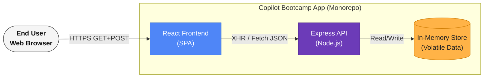
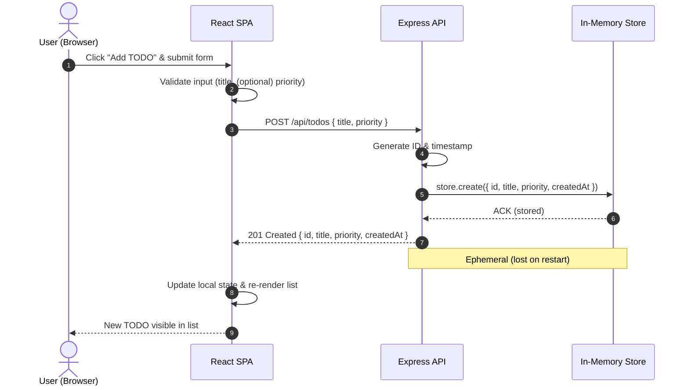

# Cloud Architecture Overview

This document provides a high-level system context view of the application contained in this monorepo. The stack includes:

- React Frontend (SPA) served to end users
- Express.js Backend API (Node.js)
- In-Memory Data Store (ephemeral — suitable for local/dev; replace with persistent store for prod)

The diagram below illustrates the primary actors, system boundary, and internal components at a conceptual (Context) level.

## System Context Diagram

## Interaction Summary
1. End user loads the React SPA over HTTPS.
2. The SPA issues API requests (JSON) to the Express backend.
3. The backend performs synchronous, in-memory reads/writes (non-durable).

## Non-Functional Notes
- Current data layer is ephemeral: restarting the backend clears state.
- For production readiness, consider replacing the in-memory store with:
  - Redis (cache/session)
  - PostgreSQL / MongoDB (persistent domain data)
- Add an API gateway / edge CDN (e.g., CloudFront, Fastly) for scaling and caching static assets.
- Introduce authentication (e.g., JWT, OAuth) if user-specific data emerges.

## Next-Step Suggestions (Beyond Scope of Current Diagram)
- Containerization (Docker) and orchestration (Kubernetes) for horizontal scaling.
- Observability stack: structured logging, metrics, tracing.
- CI/CD pipeline integrating tests, linting, vulnerability scanning.

## Sequence: Creating a TODO

The following sequence shows the interactions when a user creates a new TODO item via the UI.

### Notes on the Flow
- Validation kept lightweight client-side; backend should still enforce required fields.
- ID strategy is implicit (e.g., UUID or incremental counter) — define explicitly for consistency.
- Consider optimistic UI update (render before server response) once error handling is robust.
- For persistence, replace MEM with a database; step transitions remain similar.

---
_Last updated: 2025-09-28 (sequence diagram added)_
